# Missing MRI Modality Imputation using MM-GAN

<p align="center">
  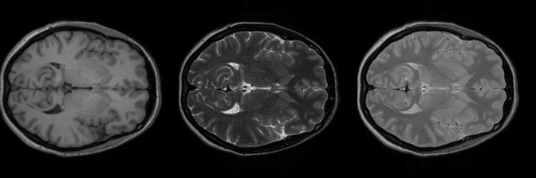
  &nbsp;
  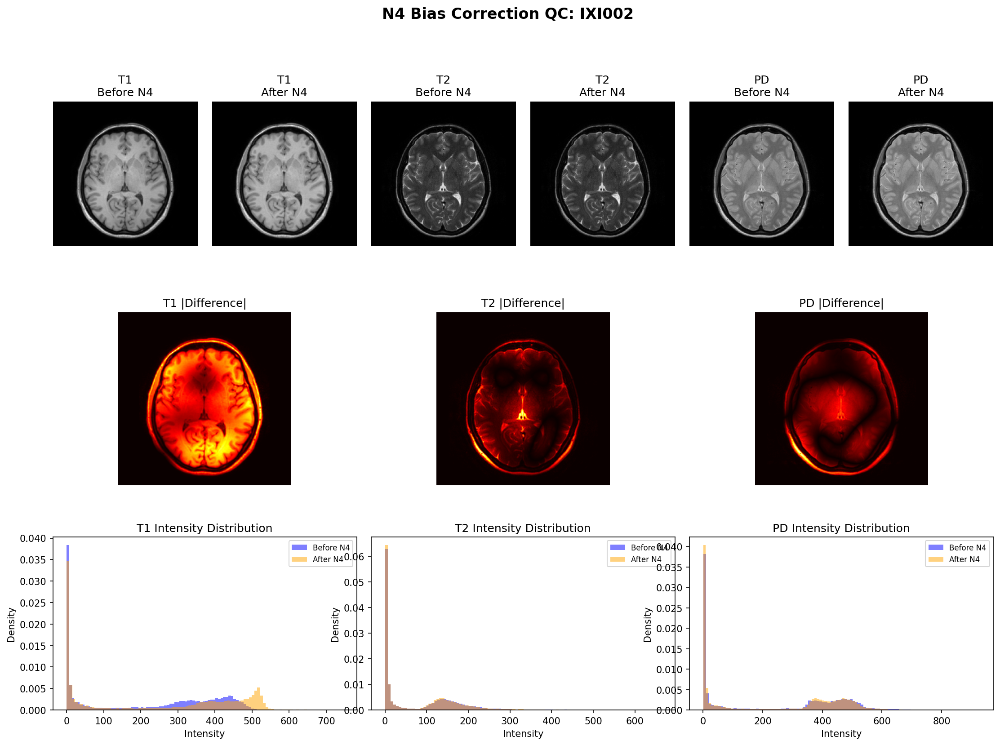
</p>
<p align="center">
  <em>Left: Registered IXI brain MRI slices (T1 · T2 · PD). &nbsp; Right: N4 bias field correction — before vs. after.</em>
</p>

---

[Anas](https://github.com/Anas-github-acc)

---

## Why This Project?

In clinical practice, acquiring all MRI modalities for a patient is not always possible. Scanner constraints, time pressure, patient tolerance, cost, or protocol differences mean that radiologists often have to work with incomplete sets of MRI sequences. A patient may have T1 but lack T2 and PD, or vice versa.

Missing modalities are a direct bottleneck for pipelines that depend on multi-modal inputs — segmentation networks, diagnosis systems, and registration tools all degrade when expected channels are absent.

This project explores whether a generative model can **learn to synthesize plausible missing modalities** from whatever subset is available, and whether improving input signal quality (via N4 bias field correction) meaningfully changes what the model learns.

---

## Introduction

This project implements and adapts **MM-GAN**, a unified multi-modal GAN for synthesizing missing MRI modalities, originally proposed by Sharma & Hamarneh ([IEEE TMI, 2020](https://ieeexplore.ieee.org/document/8859286)). The core idea is a single model capable of generating *any* missing modality from *any* available subset, without retraining for each input-output combination.

The implementation is applied to the [IXI brain MRI dataset](https://brain-development.org/ixi-dataset/) (T1, T2, PD) across all 6 possible missing-modality scenarios. The preprocessing pipeline incorporates N4 bias field correction after registration to reduce scanner-induced intensity inhomogeneity before slice extraction. Training uses curriculum learning — progressing from easy (one missing) to hard (two missing) scenarios — and runs on Kaggle GPU sessions with checkpoint-based resumption.

<p align="center">
  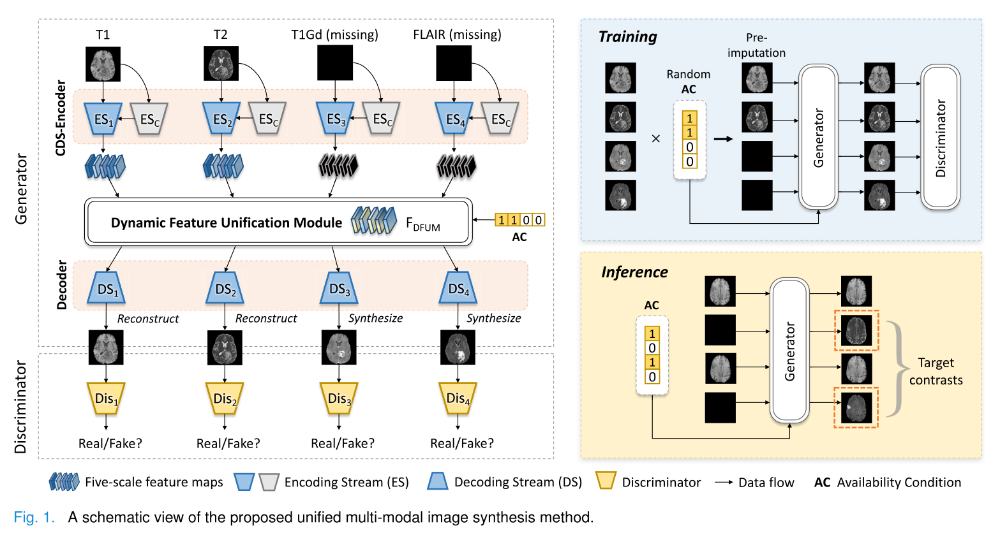
</p>
<p align="center">
  <em>MM-GAN synthesizes each missing modality conditioned on all available ones.</em>
</p>

---

## Getting Started

### Installation

```bash
git clone https://github.com/Anas-github-acc/unified-mm_imputation.git
cd unified-mm_imputation.git
# create venv
python -m venv .venv
source .venv/bin/activate # for linux
pip install -r requirements.txt
```

Key dependencies: `torch`, `antspyx`, `SimpleITK`, `nibabel`, `numpy`, `scikit-image`, `matplotlib`, `tqdm`.

### 1. Image Preprocessing (CPU based processing - no need for gpu)

Runs entirely locally. Downloads IXI, registers modalities, optionally applies N4 correction, extracts 2D slices, and saves QC figures.

```bash
python phase1_preprocessing/run_phase1.py
```

The pipeline auto-detects available CPU cores for parallel processing. No GPU is required.

### 2. Multi-Model Training (need good GPU)
#### Recommended to train on Kaggle on Tesla T4 with 2x GPU accelerator

The training script automatically selects the best available device:

```python
# Auto device selection used internally by train.py
device = torch.device("cuda" if torch.cuda.is_available() else "cpu")
```

```bash
# use notebook script: phase2_training/kaggle_notebook.ipynb
# upload it - attach the dataset - correct the dataset path in config cell and save and run 
```
Or

**Train the model on your Local wiht good GPU:**

```bash
python phase2_training/train.py \
    --data_dir data/processed/optimized_n4 \
    --experiment optimized \
    --n_epochs 60 \
    --batch_size 8 \
    --device auto
```

**Resume an interrupted run:**

```bash
python phase2_training/train.py \
    --data_dir data/processed/baseline \
    --experiment baseline \
    --resume
```

### Evaluate

```bash
python phase2_training/evaluate.py --experiment optimized
```

---

## Visualization

Quality control figures are generated automatically during Phase 1 and saved into `artifacts/qc/`.

**Registration overlays** — T1, T2, and PD shown side-by-side after affine alignment into PD space:

<p align="center">
  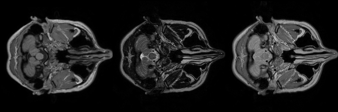
  &nbsp;
  
  &nbsp;
  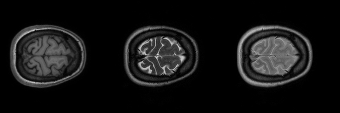
</p>
<p align="center">
  <em>Subject IXI002 — inferior, mid, and superior axial slices after registration. Columns: T1 · T2 · PD.</em>
</p>

**N4 Bias Field Correction** — each panel shows the uncorrected (left) vs. corrected (right) volume for the same subject:

<p align="center">
  
  &nbsp;
  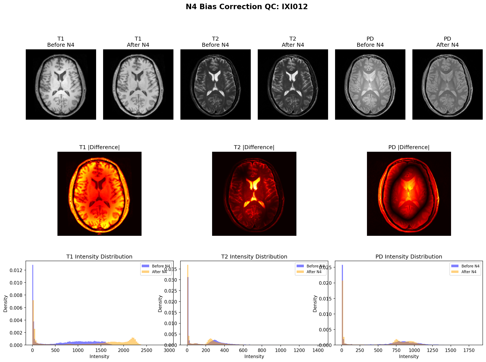
</p>
<p align="center">
  <em>N4 bias field correction. Intensity gradients caused by scanner field inhomogeneity are visibly reduced after correction.</em>
</p>

---

## Results

### Training & Validation Curves

<p align="center">
  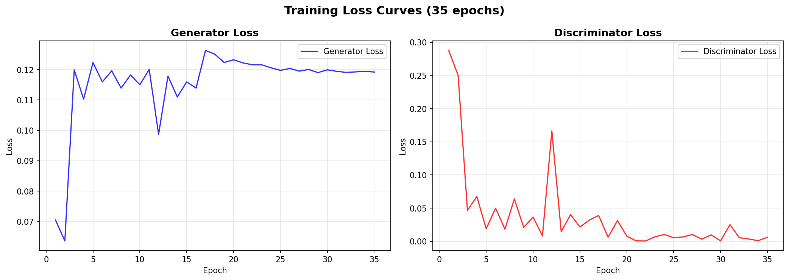
  &nbsp;
  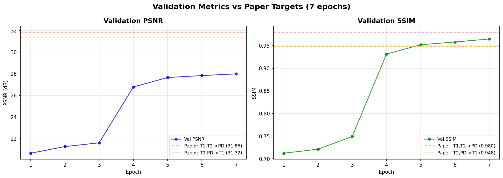
</p>
<p align="center">
  <em>Left: Generator and discriminator training losses over epochs. Right: Validation PSNR and SSIM throughout training.</em>
</p>

### Per-Scenario Metrics

Computed on the held-out test set at epoch 34. Results compared against the paper's reported IXI values where available.

| Scenario | Available | Synthesized | PSNR (dB) | ± | SSIM | ± | Paper PSNR | Paper SSIM |
|:---:|---|---|:---:|:---:|:---:|:---:|:---:|:---:|
| `011` | T2, PD | T1 | 29.87 | 2.51 | 0.8955 | 0.0447 | 31.32 | 0.948 |
| `101` | T1, PD | T2 | 31.22 | 2.42 | 0.9194 | 0.0299 | — | — |
| `110` | T1, T2 | PD | 31.46 | 4.04 | 0.9136 | 0.0330 | 31.86 | 0.980 |
| `001` | PD | T1, T2 | 28.69 | 2.19 | 0.8793 | 0.0409 | — | — |
| `010` | T2 | T1, PD | 28.71 | 3.49 | 0.8698 | 0.0531 | — | — |
| `100` | T1 | T2, PD | 25.92 | 2.67 | 0.8020 | 0.0605 | — | — |
| **Overall** | | | **29.31** | | **0.8799** | | | |

> **PSNR:** Peak Signal-to-Noise Ratio in dB — higher is better.
> **SSIM:** Structural Similarity Index (0–1) — higher is better.
> Paper benchmarks from Sharma & Hamarneh, Table II (IXI 3-modality).

### PSNR & SSIM per Scenario

<p align="center">
  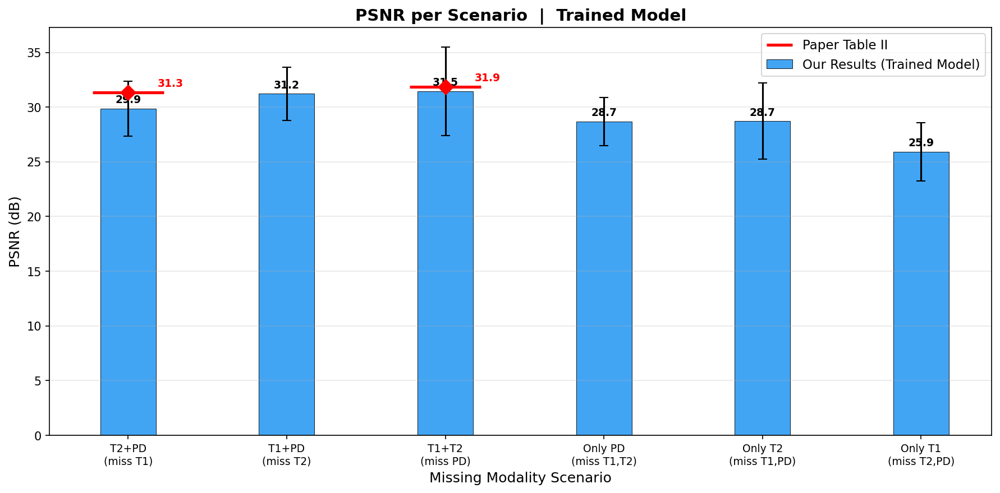
  &nbsp;
  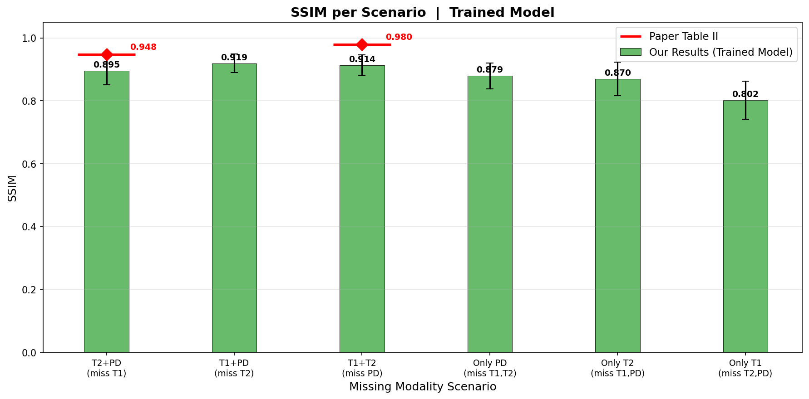
</p>
<p align="center">
  <em>Per-scenario PSNR (left) and SSIM (right) on the test set. Scenarios with two available modalities consistently outperform single-modality inputs.</em>
</p>

### Qualitative Results - Synthesized Modalities

Each row shows: real image · synthesized image · absolute error map.

**Missing T1** (synthesized from T2 + PD):

<p align="center">
  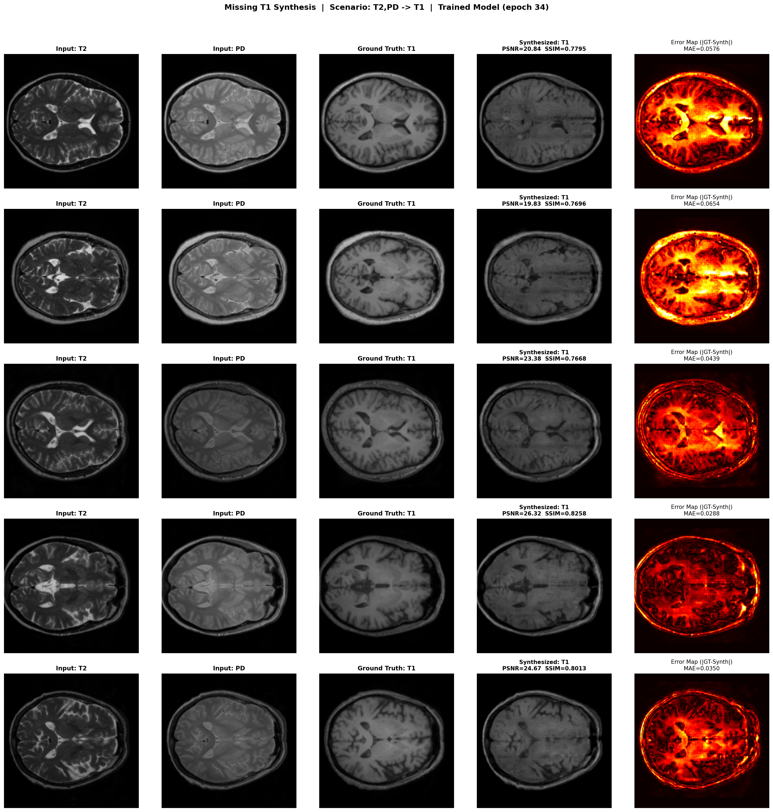
</p>

### Key Observations

- Scenarios with **two available modalities** (`011`, `101`, `110`) achieve PSNR above 29 dB and SSIM above 0.91, while single-modality inputs score lower — confirming that richer context drives better synthesis.
- The hardest scenario is `100` (only T1 available, synthesize both T2 and PD) at 25.92 dB PSNR.
- For the two scenarios with paper benchmarks (`011` and `110`), this implementation is within **1–2 dB PSNR** and **0.05–0.07 SSIM** of the reported values, validating the adaptation.

## Links & References

Original Paper — Sharma et al., IEEE TMI 2020 - [10.1109/TMI.2019.2945346](https://ieeexplore.ieee.org/document/8859286)
<br>N4ITK — Tustison et al., IEEE TMI 2010 - [10.1109/TMI.2010.2046908](https://ieeexplore.ieee.org/document/5445030)
<br>IXI Dataset - [brain-development.org/ixi-dataset](https://brain-development.org/ixi-dataset/)
<br>MM-GAN original code - [github.com/trane293/mm-gan](https://github.com/trane293/mm-gan)
<br>ANTsPy - [github.com/ANTsX/ANTsPy](https://github.com/ANTsX/ANTsPy)


## Citation

If you use this code or find it useful, please cite the original MM-GAN paper:

```bibtex
@article{sharma2020missing,
  title   = {Missing MRI pulse sequence synthesis using multi-modal generative adversarial network},
  author  = {Sharma, Anmol and Hamarneh, Ghassan},
  journal = {IEEE Transactions on Medical Imaging},
  volume  = {39},
  number  = {4},
  pages   = {1176--1186},
  year    = {2020},
  doi     = {10.1109/TMI.2019.2945346}
}
```

---

## License

For academic and research use only. See [LICENSE](LICENSE).
